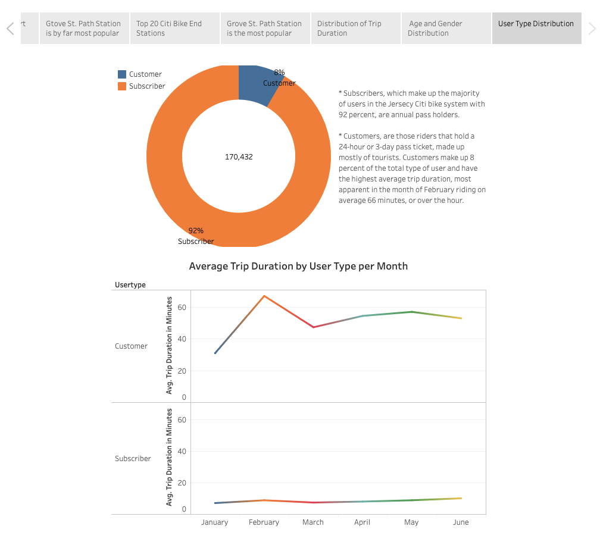
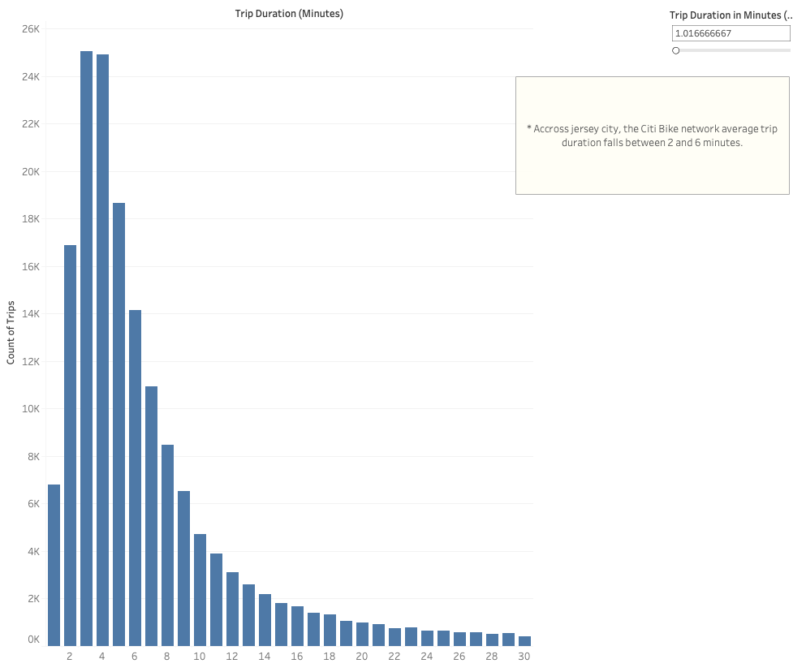
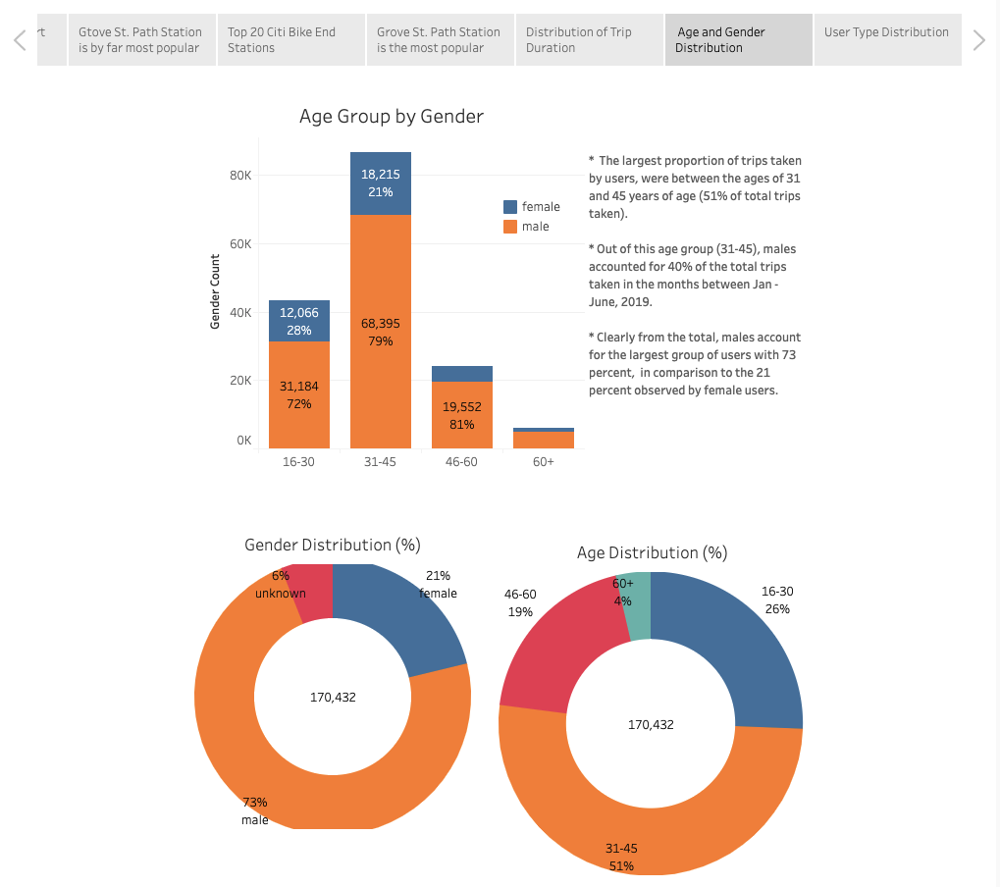
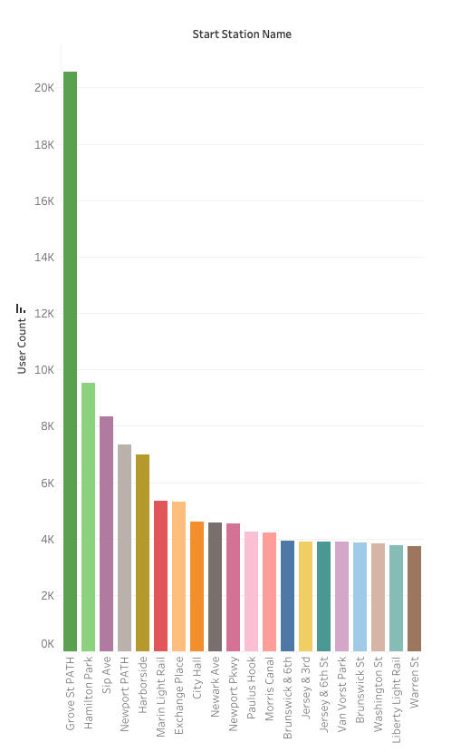
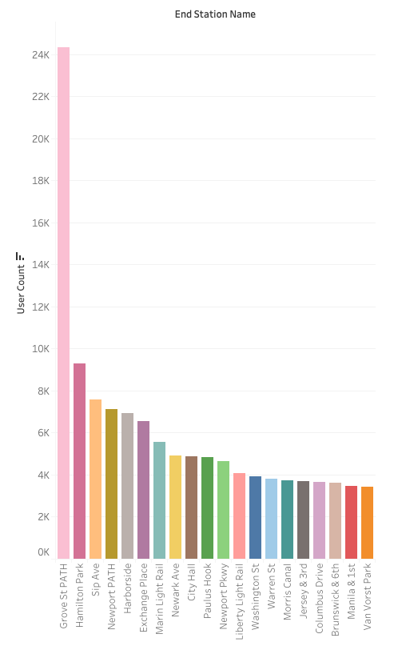
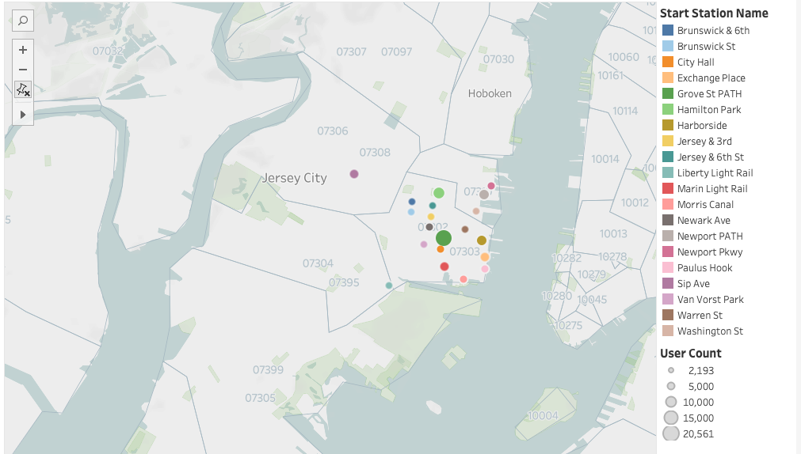
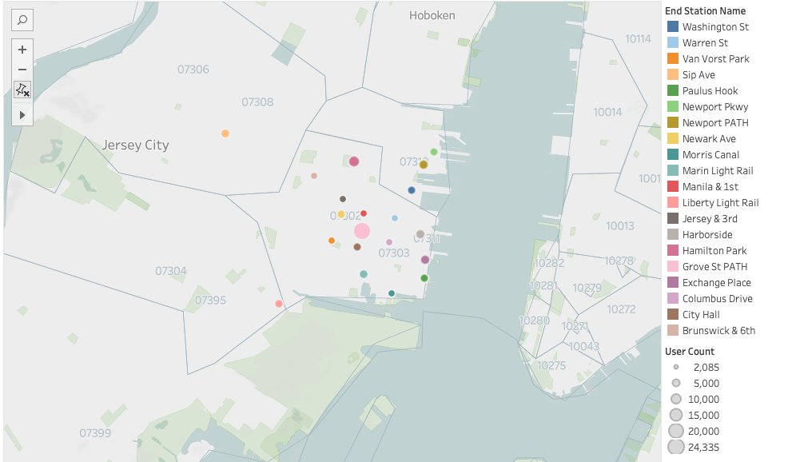

# Tableau - Citi Bike Analytics

Analysis of Citi Bike's trip usage data. 

## Data Source
* Citi Bike trip history data within Jersey City is available via the Citi Bike official website [Citi Bike Data](https://www.citibikenyc.com/system-data).

* For the purposes of this study, trip usage data between the months of January and June 2019 was gathered and analyzed.

## Questions:
- How many trips have been recorded total during the chosen period (Jan - June 2019)?
- Based on 2019 data, what are the top 20 stations in the city for starting a journey? 
- Based on 2019 data, what are the top 20 stations in the city for ending a journey?
- What is the average trip duration?
- What is the average daily trip duration in minutes?
- How does the average trip duration change by age?
- How does the average trip duration change by user type (Subscriber vs. Customer)?
- What is the average trip duration by user type per month? 
- What is the gender breakdown of active participants (Male vs. Female)?
- What is the age group breakdown of active participants? 

## Tools Used:
Tableau, Python, Jupyter Notebook

## Findings:

-----

-----

-----

<table>
  <tr>
    <td>Top Start Stations</td>
     <td>Top End Stations</td>
  </tr>
  <tr>
    <td valign="top"></td>
    <td valign="top"></td>
  </tr>
 </table>

-----

<table>
  <tr>
    <td>Top Start Stations</td>
     <td>Top End Stations</td>
  </tr>
  <tr>
    <td valign="top"></td>
    <td valign="top"></td>
  </tr>
 </table>

